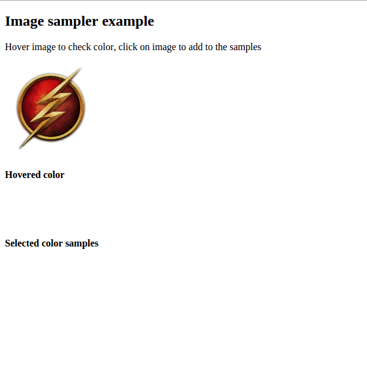
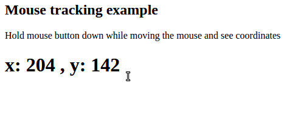

# RxJS examples

## Intro
In this repository you can find some RxJS examples that I made while I'm learning it.

## Demo
You can try the examples [here](https://rxjs.firebaseapp.com)

## Examples

### [Image sampler example](https://rxjs.firebaseapp.com/image-sampler-example/index.html)
In this example you can hover an image to see actual color. You can also click on the image to add the actual color as sample to a list.
> 2016-01-18

### [Interval example](https://rxjs.firebaseapp.com/interval-example/index.html)

> 2016-01-13

### [Mouse tracking example](https://rxjs.firebaseapp.com/mouse-tracking-example/index.html)

> 2016-01-13

### [Spotify autocomplete example](https://rxjs.firebaseapp.com/spotify-autocomplete-example/index.html)

> 2016-01-13

